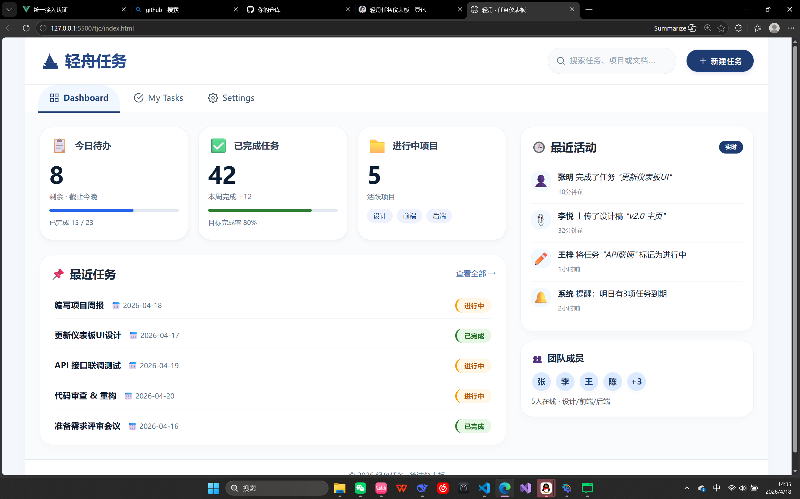
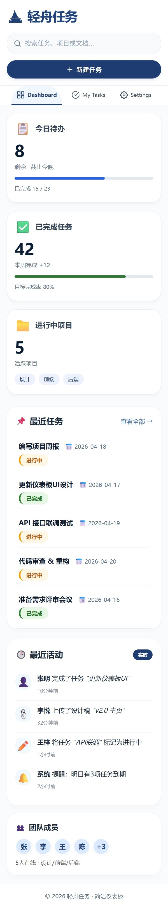

# 项目名称
轻舟任务仪表板
## 项目简介
这是一个使用 HTML + CSS 完成的任务管理页面，实现了包含顶部操作栏、导航菜单、数据卡片、任务列表及最近活动的完整后台界面，同时支持桌面端与移动端响应式展示。
## 页面包含的内容

顶部区域：页面标题、搜索框、新建任务按钮
导航区域：Dashboard、My Tasks、Settings 三个导航项
数据卡片区：今日待办、已完成任务、进行中项目统计卡片
任务列表区：展示多条任务名称、截止日期、任务状态
附加信息模块：最近活动记录

## 我是怎么实现的

### HTML 结构

我把页面分成了这几个部分：

header：放置页面标题、搜索框和按钮
nav：实现顶部导航菜单
main：作为主内容容器
section /article/aside：分别包裹数据卡片、任务列表、最近活动模块
结构上使用了语义化标签，层次清晰，便于阅读和维护。

### CSS 布局

我主要使用了：

flex：用于顶部栏左右布局、导航项排列、卡片内部对齐、任务项横向分布、活动记录排版等
grid：用于主内容区的两栏布局（左侧内容 + 右侧侧边栏），以及数据卡片的多列自适应排列

### 响应式处理

当屏幕变小时，我做了这些调整：

主内容区从两栏 grid 变为单列堆叠
数据卡片从多列自动变为单列展示
顶部导航自动压缩，适配手机宽度
搜索框和按钮在移动端变为全屏宽度
任务列表、活动记录自动换行，不出现内容溢出或错位

## 页面截图

### 桌面端

### 移动端

